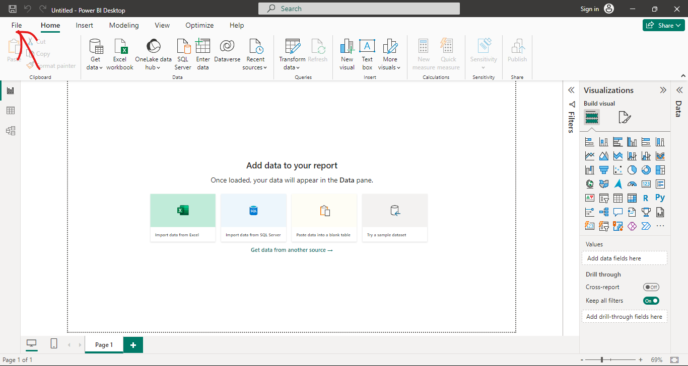
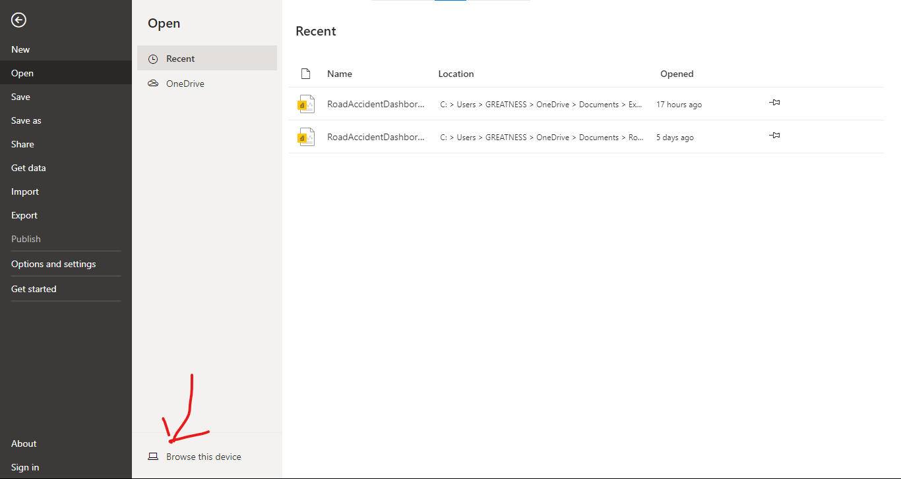
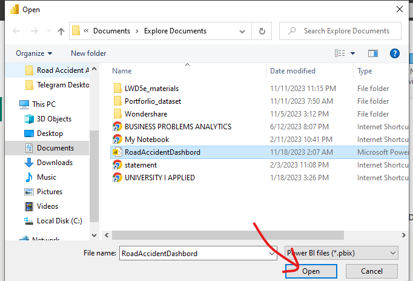
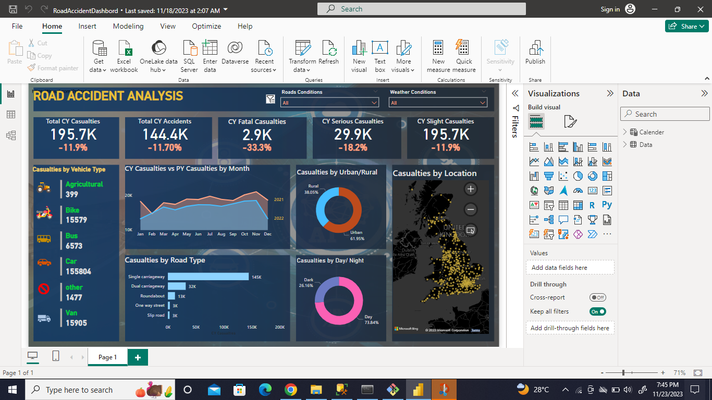

# RoadAccidentAnalysis
The primary objective of this project is to dissect the intricate web of factors influencing road accidents through a dual approach—leveraging the power of Structured Query Language (SQL) for meticulous data analysis and harnessing the visualization capabilities of PowerBI to convey insights effectively.

__Tools to access the resources in the project  in PowerBI__
1. Download the file from the github repo
2. Download [Microsoft PowerBI for Desktop](https://powerbi.microsoft.com/en-us/downloads/) to load the power BI dashbord
   install and follow this steps to fully access the functionality of the Dashboard
3. 
4. 
5.  
6. 

  __ Tools to access the resources in the project  in SQL SERVER__
  Follow the step specify in this [Tutorial](https://www.sqlservertutorial.net/install-sql-server/)
   
